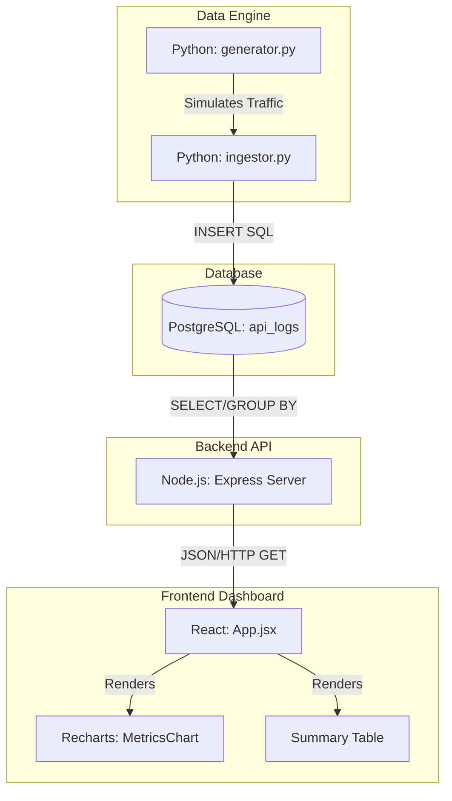

# InfraSight


## Overview
In modern enterprise environments, companies rely on hundreds of microservices. When a system goes down or slows down, the business loses money, customers, and reputation.

InfraSight solves a critical business problem: **System Visibility**. It is a full-stack telemetry dashboard that visualizes server errors and latency spikes in real-time, allowing engineering teams to detect and fix bottlenecks before they cause a complete outage. By combining a Python-based data engine for generating and ingesting network telemetry with a fast Node.js API and a responsive React frontend, InfraSight provides clear insights into SLA compliance and system health.

## Key Features
*   **Proactive Incident Management:** Visualizes 5xx server errors and latency spikes in real-time.
*   **SLA Monitoring:** Tracks exact average latency and total requests per endpoint for SLA compliance.
*   **Resource Allocation Insights:** Identifies high-traffic endpoints to optimize scaling and reduce costs.
*   **High-Performance Architecture:** Uses Python for heavy-lifting data ingestion and Node.js for non-blocking, fast data retrieval.
*   **Interactive Dashboard:** React-based frontend using Recharts for live time-series graphs and summary tables.

## System Architecture

InfraSight utilizes a classic microservice pattern combining Python, Node.js, PostgreSQL, and React. 

*   **Python (The Data Engine):** Acts as a background worker. It handles continuous generation of simulated network traffic and ingests telemetry data into the database.
*   **Node.js (The API Server):** An Express.js REST API that handles thousands of lightweight read requests, processing advanced SQL queries (aggregation, filtering) to serve real-time analytics to the dashboard.
*   **PostgreSQL (Database):** Stores the raw telemetry logs with optimized indexes for hyper-fast time-based and endpoint-based retrieval.
*   **React (Frontend):** Fetches the JSON data from the Node.js API and visualizes it using Recharts and dynamic HTML tables.

### Architecture Diagram



## Directory Structure
```
.
├── backend/                  # Node.js API server
│   ├── config/               # Database connection config
│   ├── routes/               # API endpoints (analytics.js)
│   ├── server.js             # Express app entry point
│   └── package.json          # Node dependencies
├── data-engine/              # Python data generation & ingestion
│   ├── generator.py          # Network traffic simulator
│   ├── ingestor.py           # Database writing logic
│   ├── requirements.txt      # Python dependencies
│   └── .env                  # DB credentials
├── database/                 # Database structure
│   └── schema.sql            # PostgreSQL table schema and indexes
└── frontend/                 # React frontend application
    ├── src/                  # React source code (App, API fetches, Charts)
    ├── index.html            # Entry HTML file
    └── package.json          # Frontend dependencies
```

## Prerequisites
*   **Node.js:** v18+ 
*   **Python:** 3.8+
*   **PostgreSQL:** 13+
*   **npm:** v9+ or **yarn**

## Installation

1. **Clone the repository:**
   ```bash
   git clone https://github.com/Shivamrana0309/InfraSight.git
   cd InfraSight
   ```

2. **Database Setup:**
   Make sure PostgreSQL is running, then create the database and tables:
   ```bash
   psql -U postgres -c "CREATE DATABASE infrasight;"
   psql -U postgres -d infrasight -f database/schema.sql
   ```

3. **Data Engine (Python):**
   ```bash
   cd data-engine
   python3 -m venv venv
   source venv/bin/activate
   pip install -r requirements.txt
   cd ..
   ```

4. **Backend (Node.js):**
   ```bash
   cd backend
   npm install
   cd ..
   ```

5. **Frontend (React):**
   ```bash
   cd frontend
   npm install
   cd ..
   ```

## Configuration
You need to set up environment variables for both the backend and the data engine.

1. **Backend Configuration:**
   Create a `.env` file in the `backend/` directory:
   ```env
   DB_USER=postgres
   DB_PASSWORD=your_password
   DB_HOST=localhost
   DB_PORT=5432
   DB_NAME=infrasight
   PORT=5001
   ```

2. **Data Engine Configuration:**
   Create a `.env` file in the `data-engine/` directory:
   ```env
   DB_USER=postgres
   DB_PASSWORD=your_password
   DB_HOST=localhost
   DB_PORT=5432
   DB_NAME=infrasight
   ```

## Usage/Running the App
To run the full stack, you will need three terminal windows.

**Terminal 1: Start the Data Engine**
```bash
cd data-engine
source venv/bin/activate
python ingestor.py
```

**Terminal 2: Start the Backend API**
```bash
cd backend
npm run dev
```
*(The server will start on http://localhost:5001)*

**Terminal 3: Start the Frontend Application**
```bash
cd frontend
npm run dev
```
*(The application will be accessible at http://localhost:5173 or the URL provided by Vite)*

## API Usage Examples

**Get Summary Metrics:**
```bash
curl -X GET http://localhost:5001/api/analytics/summary
```
**Response:**
```json
[
  {
    "endpoint": "/api/payment",
    "total_requests": 1500,
    "average_latency_ms": 125.4,
    "error_count": 12
  }
]
```

**Get Time-series Data:**
```bash
curl -X GET http://localhost:5001/api/analytics/timeseries
```
**Response:**
```json
[
  {
    "time_bucket": "2023-10-27T10:00:00.000Z",
    "avg_latency": 110.5,
    "errors": 2
  }
]
```

## Contributing
Contributions are welcome! Please feel free to submit a Pull Request.
1. Fork the Project
2. Create your Feature Branch (`git checkout -b feature/AmazingFeature`)
3. Commit your Changes (`git commit -m 'Add some AmazingFeature'`)
4. Push to the Branch (`git push origin feature/AmazingFeature`)
5. Open a Pull Request

## License
Distributed under the MIT License. See `LICENSE` for more information.
