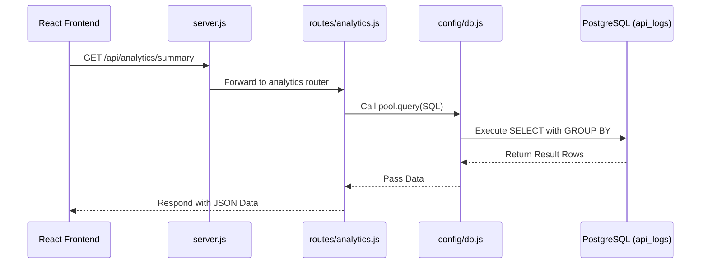

# Backend Component Overview
The backend is the central API layer of the InfraSight project. In this 4-tier system, the Python Data Engine writes raw telemetry logs to PostgreSQL, while this Node.js backend serves as a high-performance Data Access Layer (DAL) for the Frontend. It efficiently handles thousands of read requests without blocking, running complex aggregations over the SQL database and returning clean JSON payloads for the React dashboard to render.

# System Architecture (Backend Context)
The backend follows a lightweight **Modular Router Pattern**, utilizing Express.js.
- **Entry Point:** `server.js` initializes the Express application and binds middleware.
- **Routing:** API paths are delegated to modular routers (e.g., `/api/analytics` mapped to `routes/analytics.js`).
- **Controllers/DAL:** In this micro-setup, the route handlers in `analytics.js` act as both controllers and the Data Access Layer, directly executing raw SQL strings via the database connection pool.
- **Database:** `config/db.js` abstracts the `pg` connection pool.

### Flow Diagram


# Database Integration & Data Flow
The backend uses raw SQL over an Object-Relational Mapper (ORM). 
- **Connection Setup:** It uses the `pg` (node-postgres) library to create a connection `Pool`. This pool handles multiple concurrent connections efficiently, avoiding the overhead of opening and closing connections per request.
- **Query Mechanism:** Queries are written in standard PostgreSQL dialect. For example, it uses `DATE_TRUNC` for time-series bucketing and `GROUP BY` with aggregate functions (`AVG`, `SUM`, `COUNT`) to process the raw logs directly on the database engine.
- **Data Flow:** Requests trigger async functions that await the `pool.query()`. The resulting `.rows` array is then serialized into JSON and sent back via HTTP.

# API Inter-connectivity Map
The backend currently exposes two primary, independent endpoints:
- `GET /api/analytics/summary`
- `GET /api/analytics/timeseries`

**Inter-connectivity:** These endpoints are fully independent and stateless. They do not call each other or rely on internal service-to-service communication. Both directly depend on the `pool.query` export from `config/db.js`. 

# Comprehensive File & Function Reference

### `server.js`
The main entry point for the Express application.
*   **`app.use(cors())`**: Binds CORS middleware to allow cross-origin requests from the React frontend.
*   **`app.use(express.json())`**: Parses incoming request payloads as JSON.
*   **`app.use('/api/analytics', analyticsRoutes)`**: Mounts the imported router to the specific API prefix.
*   **`app.listen(PORT, callback)`**: 
    *   **Purpose:** Starts the HTTP server.
    *   **Parameters:** `PORT` (number), `callback` (function to run on successful start).
    *   **Internal logic:** Binds the Express app to the port defined in `.env` (or default 5001).
    *   **Return:** None (starts listening process).

### `config/db.js`
Manages the PostgreSQL connection pool.
*   **`new Pool(config)`**:
    *   **Purpose:** Initializes a reusable pool of database connections.
    *   **Parameters:** `config` object with credentials (`user`, `password`, `host`, `port`, `database`).
    *   **Internal logic:** Reads credentials from `process.env`.
    *   **Return:** A `Pool` instance.
*   **`pool.query('SELECT 1', callback)`**:
    *   **Purpose:** Immediately tests the database connection on server startup.
    *   **Parameters:** SQL string, callback function `(err, res)`.
    *   **Internal logic:** Executes a dummy query. If it fails, logs an error; if succeeds, logs success.
    *   **Return:** `void`.

### `routes/analytics.js`
Defines the REST endpoints and SQL logic for analytical data.
*   **`router.get('/summary', async (req, res))`**:
    *   **Purpose:** Fetches aggregated metrics (totals, averages, errors) grouped by endpoint.
    *   **Parameters:** standard Express `req` (request) and `res` (response) objects.
    *   **Internal logic:** Executes a raw SQL `SELECT` with `COUNT`, `ROUND(AVG(...))`, and `SUM(CASE WHEN...)` grouped by the `endpoint` column. Uses `await pool.query(query)`.
    *   **Return:** Responds with a JSON array of objects (the database rows) or a 500 status code on error.
*   **`router.get('/timeseries', async (req, res))`**:
    *   **Purpose:** Fetches time-bucketed data for the frontend line chart.
    *   **Parameters:** standard Express `req` and `res` objects.
    *   **Internal logic:** Executes a raw SQL `SELECT` using `DATE_TRUNC('minute', timestamp)` to group data chronologically into 1-minute intervals. 
    *   **Return:** Responds with a JSON array of the latest 15 time buckets.

### `.env`
Environment configuration file containing the `PORT` and database credentials (`DB_USER`, `DB_PASSWORD`, `DB_HOST`, `DB_PORT`, `DB_NAME`).

### `package.json`
Manages Node.js dependencies (`express`, `pg`, `cors`, `dotenv`, `nodemon`) and run scripts.

### `run.txt`
A quick reference text file containing a single setup command: `npm install`.

# Setup & Execution

### Prerequisites
*   Node.js (v18+)
*   PostgreSQL running locally or remotely with the `infrasight` database and `api_logs` table provisioned.

### Setup Steps
1. **Navigate to the directory:**
   ```bash
   cd backend
   ```
2. **Install dependencies:**
   ```bash
   npm install
   ```
3. **Environment Variables:**
   Ensure the `.env` file matches your PostgreSQL database credentials.
4. **Run the server (Development Mode):**
   ```bash
   npm run dev
   ```
   *(This uses `nodemon` for auto-reloading during development).*
5. **Run the server (Production Mode):**
   ```bash
   npm start
   ```
