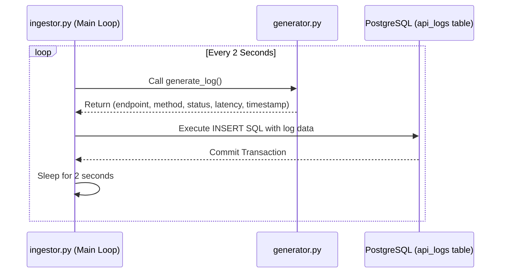

# Data Engine Component Overview
The Data Engine acts as the backbone for raw data generation and ingestion in the InfraSight telemetry dashboard. Operating as a background worker, this Python-based component simulates a live network environment by continually generating mock API request logs and writing them directly to the database. It is designed for isolated execution (batch/continuous processing) and is responsible for populating the database that the Node.js backend relies on for analytics.

# System Architecture (Data Pipeline Context)
The data engine follows a **Continuous Event Ingestion** pattern.
- **Generation:** A standalone script generates randomized payload data representing API interactions.
- **Ingestion Loop:** A main worker script continuously imports the generator function and writes the data to the PostgreSQL database in an infinite loop (`while True`).
- **Decoupled Design:** The engine only knows how to generate data and talk to the database. It has no direct interaction with the Node.js backend or React frontend.

### Data Flow Diagram


# Database Integration & Data Flow
The data engine integrates directly with the database using the `psycopg2` adapter.
- **Credentials Management:** Environment variables are loaded securely using the `python-dotenv` library. The credentials correspond to the shared `infrasight` PostgreSQL instance.
- **Loading Procedure:** 
  - It opens a single persistent database connection and cursor.
  - Inside a continuous loop, it executes parameterized `INSERT INTO api_logs` raw SQL statements.
  - Changes are saved iteratively using `conn.commit()`.
  - It uses a `try...finally` block to ensure the database connection and cursor are safely closed upon an interrupt signal (e.g., `Ctrl+C`).

# Pipeline Inter-connectivity Map
The pipeline consists of two primary scripts that run sequentially in a single process.
- **`generator.py`**: A stateless utility module. It is imported by the ingestor.
- **`ingestor.py`**: The master worker script. It is the entry point that triggers the `generator.py` and pushes the output to the database. It acts as an endless while-loop daemon.

# Comprehensive File & Function Reference

### `generator.py`
Simulates a live network environment by producing randomized HTTP request metrics.
*   **`generate_log()`**:
    *   **Purpose:** Creates a single, randomized, realistic API request log.
    *   **Input Parameters:** None.
    *   **Internal Logic:** 
        - Selects a random endpoint (e.g., `/api/users`, `/api/payments`, `/api/products`, `/auth/login`).
        - Enforces business logic (e.g., `/api/payments` is always a `POST` request).
        - Introduces a 5% probability of a "server crash," which yields 5xx errors and massive latency spikes (1000-5000ms).
        - For normal operations (95% chance), assigns standard HTTP codes (200, 201, 400, 404) and low latency (20-300ms).
        - Stamps the event with the current system time using `datetime.now()`.
    *   **Output:** Returns a Python tuple containing `(endpoint, method, status_code, latency_ms, timestamp)`.

### `ingestor.py`
The main ingestion daemon that writes data to PostgreSQL.
*   **`DB_CONFIG` (Dictionary)**: Securely fetches and structures database credentials from `.env`.
*   **`ingest_data()`**:
    *   **Purpose:** Connects to the database and runs the infinite data generation loop.
    *   **Input Parameters:** None.
    *   **Internal Logic:**
        - Establishes a `psycopg2` connection.
        - Enters a `while True` loop.
        - Calls `generate_log()` to get fresh data.
        - Executes an `INSERT INTO api_logs` SQL query using parameterized inputs (`%s`) to prevent SQL injection.
        - Calls `conn.commit()` to finalize the write.
        - Sleeps for 2 seconds before generating the next log.
        - Catches `KeyboardInterrupt` to gracefully close the `cursor` and `conn`.
    *   **Output:** `void` (writes side-effects to the database and console stdout).

### `.env`
Environment configuration file containing the database credentials (`DB_USER`, `DB_PASSWORD`, `DB_HOST`, `DB_PORT`, `DB_NAME`).

### `requirements.txt`
Specifies the Python dependencies required for the engine:
- `psycopg2-binary==2.9.9`: PostgreSQL adapter.
- `python-dotenv==1.0.1`: Loads environment variables from `.env`.

### `run.txt`
A quick reference guide documenting the `pip install` command and explaining the purpose of the required libraries.

# Setup & Execution

### Prerequisites
*   Python 3.8+
*   PostgreSQL running locally or remotely with the `api_logs` table already provisioned.

### Setup Steps
1. **Navigate to the directory:**
   ```bash
   cd data-engine
   ```
2. **Create and Activate a Virtual Environment:**
   ```bash
   python3 -m venv venv
   source venv/bin/activate  # On Windows use: venv\Scripts\activate
   ```
3. **Install dependencies:**
   ```bash
   pip install -r requirements.txt
   ```
4. **Environment Variables:**
   Ensure the `.env` file matches your PostgreSQL database credentials.
5. **Run the Ingestion Pipeline:**
   ```bash
   python ingestor.py
   ```
   *(The script will run infinitely, printing logs to the console. Press `Ctrl+C` to stop).*
