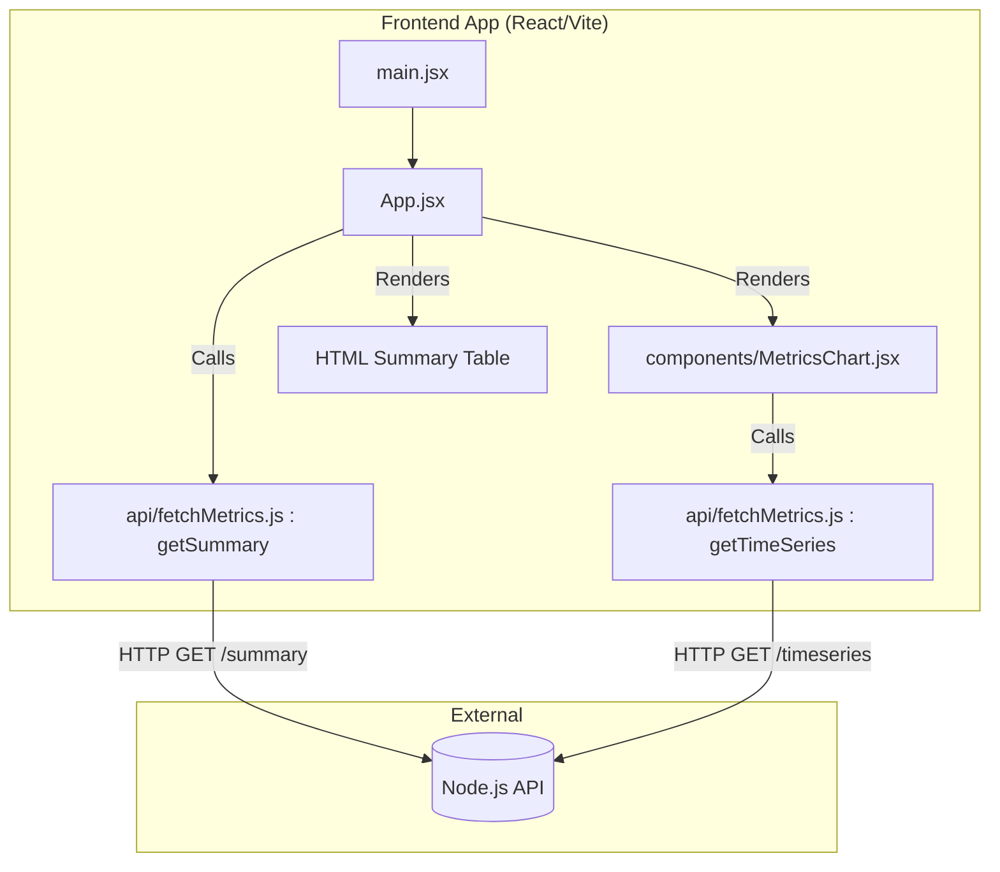

# Frontend Component Overview
The Frontend is the user-facing presentation layer of the InfraSight project. Built with React and Vite, its primary goal is to provide real-time UI/UX visibility into system health, rendering metrics in clean, human-readable formats. It consumes the JSON APIs provided by the Node.js backend to display a live time-series chart of network latency and errors, alongside a summary table of endpoint health. The focus is on responsiveness and immediate feedback, avoiding full page reloads via asynchronous data fetching.

# System Architecture (Frontend Context)
The frontend utilizes a lightweight **Component-Based Architecture** with localized state management.
- **State Management:** Uses React's built-in `useState` and `useEffect` hooks. Global state (like Redux or Context) is omitted to keep the architecture simple; each primary component is responsible for fetching and managing its own required data slice.
- **Component Hierarchy:** `main.jsx` mounts `App.jsx`, which acts as the layout container. `App.jsx` handles the summary table data, while the `MetricsChart.jsx` child component handles the time-series chart.

### Component Flow Diagram


# Backend Integration & Data Flow
The frontend uses `axios` as the HTTP client to communicate with the Backend API.
- **Configuration:** The base URL is hardcoded in `api/fetchMetrics.jsx` pointing to `http://localhost:5001/api/analytics`.
- **Data Flow Mechanism:** 
  - Both `App.jsx` and `MetricsChart.jsx` utilize `setInterval` inside a `useEffect` hook to poll the backend every 5 seconds.
  - Asynchronous responses are awaited, caught for errors, and then injected directly into the React component state (`setMetrics` and `setChartData`), triggering a fast Virtual DOM re-render to update the view without refreshing the page.

# Routing & Page Inter-connectivity
This is a Single Page Application (SPA) with a single main view.
- **Major Route:** `/` (Index).
- **User Journey:** The user lands on the single dashboard page. No client-side routing (like `react-router-dom`) is necessary because all relevant metrics (chart and table) are consolidated into a single unified dashboard view.

# Comprehensive File & Component Reference

### `src/main.jsx`
The application's entry point that bootstraps the React tree.
*   **Purpose:** Mounts the React application to the browser's DOM.
*   **Internal Logic:** Uses `ReactDOM.createRoot` to render the `<App />` component wrapped in `<React.StrictMode>` inside the `<div id="root">` element found in `index.html`.

### `src/App.jsx`
The master layout and state manager for the summary table.
*   **`App` (Functional Component)**:
    *   **Purpose:** Renders the main dashboard layout, the summary table, and mounts the chart component.
    *   **State:** `metrics` (Array): Holds the summary data fetched from the API.
    *   **Lifecycle/Effects:** Uses `useEffect` to call `getSummary()` on mount, and sets up a `setInterval` to poll the API every 5000ms.
    *   **UI Elements Rendered:** A layout wrapper `<div className="dashboard">`, an `<h1>` title, the `<MetricsChart />` component, and an HTML `<table>` that maps over the `metrics` array to display `row.endpoint`, `row.total_requests`, `row.avg_latency_ms`, and `row.error_count`.
    *   **Internal Logic:** Includes conditional inline styling to render error counts in red if they exceed 0, and a "Health Status" column displaying '⚠️ Warning' or '✅ Healthy'.

### `src/components/MetricsChart.jsx`
Visualizes the chronological health of the network using Recharts.
*   **`MetricsChart` (Functional Component)**:
    *   **Purpose:** Fetches time-series data and renders a live, dual-axis line chart.
    *   **State:** `chartData` (Array): Formatted array for Recharts.
    *   **Lifecycle/Effects:** Uses `useEffect` to call `getTimeSeries()` and polls every 5000ms.
    *   **Internal Logic:** 
        - Takes the raw ISO timestamp (`time_bucket`) from the API and formats it into a human-readable `HH:MM` string.
        - Reverses the array chronologically so the chart reads left-to-right.
    *   **UI Elements Rendered:** A container `<div>` with styling, an `<h3>` title, and a `<ResponsiveContainer>` holding a Recharts `<LineChart>`. Maps the data to two `<Line>` components (Latency on the left Y-axis, Errors on the right Y-axis).

### `src/api/fetchMetrics.jsx`
The dedicated HTTP client module abstracting network logic away from UI components.
*   **`getSummary()`**:
    *   **Purpose:** Fetches the aggregated endpoint summary.
    *   **Internal Logic:** `axios.get(API_BASE_URL + '/summary')`. Uses a try-catch block to return `[]` gracefully if the server is offline.
    *   **Returns:** Array of objects representing database rows.
*   **`getTimeSeries()`**:
    *   **Purpose:** Fetches the 1-minute bucketed time-series data.
    *   **Internal Logic:** `axios.get(API_BASE_URL + '/timeseries')`. Also uses try-catch fallback.
    *   **Returns:** Array of objects representing database rows.

### `package.json`
Manages Frontend dependencies (`react`, `react-dom`, `recharts`, `axios`) and developer tools (`vite`, `@vitejs/plugin-react`).

### `index.html`
The base HTML template served by Vite. Contains the root `<div id="root"></div>` where React mounts.

# Setup & Execution

### Prerequisites
*   Node.js (v18+)
*   The Backend server must be running on port `5001` (or the URL defined in `fetchMetrics.jsx`).

### Setup Steps
1. **Navigate to the directory:**
   ```bash
   cd frontend
   ```
2. **Install dependencies:**
   ```bash
   npm install
   ```
3. **Run the development server:**
   ```bash
   npm run dev
   ```
   *(Vite will automatically start a local server and provide a URL, typically `http://localhost:5173`).*
4. **Build for production:**
   ```bash
   npm run build
   ```
